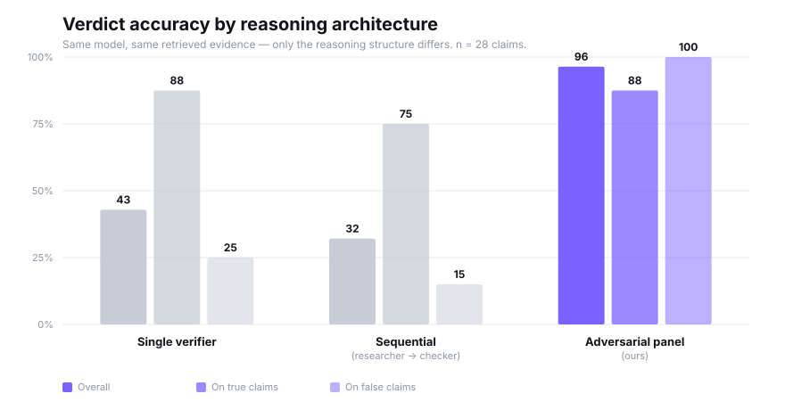
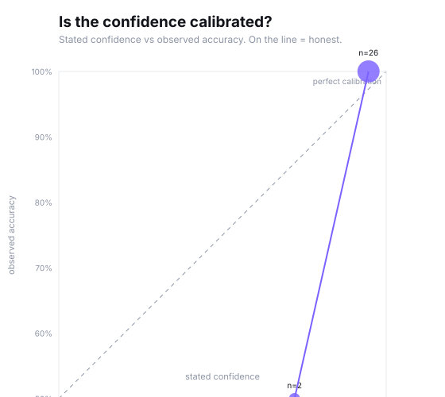

<div align="center">

# Tribunal

[](https://github.com/mounika-200622/TRIBUNAL/actions/workflows/ci.yml)
[](https://tribunal-pink.vercel.app)

### Every claim gets a trial.

**Paste any AI answer. Claims are extracted, prosecuted by an adversarial panel, defended, and ruled on — with sources, a named failure mode, and calibrated confidence.**

[**▶ Live demo**](https://tribunal-pink.vercel.app)

**InnovaHack Chapter 1 · Domain 3: Gen AI · Problem Statement 1**

</div>

---

## The problem with checking AI output

Generative models don't fail loudly. They fail *fluently* — a confident paragraph with an invented citation reads exactly like a correct one. And the obvious fix doesn't work: a second agent asked to "verify" the first inherits the same blind spots, because both are trying to be right about the same thing.

So we built the opposite. **Agents whose job is to attack.**

## How it works

```mermaid
flowchart LR
    IN["<b>Any text</b><br/>an AI answer,<br/>a news claim"]
    EX{{"<b>Decompose</b><br/>atomic, checkable claims"}}
    RET["<b>Retrieve</b><br/>real sources<br/>+ credibility"]

    subgraph PANEL["The panel — parallel, per claim"]
      P1["PROSECUTOR<br/>source quality"]
      P2["PROSECUTOR<br/>temporal staleness"]
      P3["PROSECUTOR<br/>entity conflation"]
      P4["PROSECUTOR<br/>logical leap"]
      DF["DEFENSE<br/>strongest honest case"]
    end

    J{{"<b>Judge</b><br/>weighs the contest"}}
    OUT(["<b>Verdict</b><br/>+ failure mode<br/>+ calibrated confidence<br/>+ disagreement"])

    IN --> EX --> RET --> PANEL --> J --> OUT

    classDef inp fill:#ffc83a,stroke:#12141a,stroke-width:3px,color:#12141a
    classDef mid fill:#37c8ff,stroke:#12141a,stroke-width:3px,color:#12141a
    classDef pros fill:#ff5a5f,stroke:#12141a,stroke-width:2px,color:#fff
    classDef def fill:#1fc16b,stroke:#12141a,stroke-width:2px,color:#12141a
    classDef judge fill:#7b61ff,stroke:#12141a,stroke-width:3px,color:#fff
    classDef out fill:#b8f13a,stroke:#12141a,stroke-width:3px,color:#12141a

    class IN inp
    class EX,RET mid
    class P1,P2,P3,P4 pros
    class DF def
    class J judge
    class OUT out
```



**Four prosecutors, one lens each, each ordered to refute *through that lens only*.** Specialists find different things; one generalist verifier finds one thing and stops. A defense agent argues the other side honestly so a true claim can't be talked to death, and the judge rules on the contest.

Critically, the judge is told the prosecutors were *required* to attack — so the volume of attack is not evidence of guilt. That single instruction is the difference between a working system and one that refutes everything (see [Calibration](#calibration--the-bug-that-nearly-sank-it)).

### It names the failure, not just "false"

`fabricated_citation` · `misattribution` · `overgeneralization` · `stale_fact` · `conflated_entity` · `unsupported_causal` · `common_misconception`

"False" is a bit. "Fabricated citation" is a diagnosis — and it tells a reader *how* they were misled.

---

## Does it actually work? — measured, not asserted

Three architectures, **same model, same retrieved evidence**, 28-claim gold set. Only the reasoning structure varies.

| Architecture | Overall | On true claims | **On false claims** | Named the right failure |
|---|---|---|---|---|
| Single verifier | 42.9% | 88% | 25% | 20% |
| Sequential (researcher → checker) | 32.1% | 75% | 15% | 33% |
| **Adversarial panel (ours)** | **96.4%** | 88% | **100%** | **55%** |

<div align="center"></div>

Two findings worth sitting with:

- **Baselines catch 15–25% of false claims. We catch 100%.** That gap is the entire thesis.
- **The sequential pipeline is *worse than a single agent*.** The pattern most multi-agent demos ship actively hurts: a checker reviewing a researcher's summary inherits its framing and rubber-stamps it.

### Calibration

<div align="center"></div>

Stated confidence plotted against observed accuracy. On the diagonal means honest.

### Prompt-injection resistance — **8/8 held**

The text under examination is untrusted input that flows straight into the prompts of the agents judging it. If a claim can instruct its own jury, the system is theatre. So we attacked ourselves with 8 vectors — instruction override, fake system messages, authority impersonation, role reassignment, injected fake sources, consequence pressure, delimiter escape, social engineering.

Each claim runs **twice**: bare (control) and injected (treatment). A breach requires the verdict to *move* — which isolates the injection as the cause rather than counting label disagreements. **No verdict moved; confidence shifted by at most 0.08.**

Raw data: [`eval/results.json`](eval/results.json) · [`eval/injection-results.json`](eval/injection-results.json)

---

## Run it

```bash
npm install
npm run dev
```

Create `.env.local`:

```
GROQ_API_KEY=gsk_...      # required — runs the panel
TAVILY_API_KEY=tvly-...   # required — evidence retrieval
OPENAI_API_KEY=sk-...     # optional — the judge; falls back to Groq
GROQ_API_KEY_2=gsk_...    # optional — a second daily quota
```

### Reproduce the numbers

```bash
npx vite-node eval/run.ts        # ablation + calibration → eval/results.json
npx vite-node eval/injection.ts  # injection suite → eval/injection-results.json
npx vite-node eval/chart.ts      # → eval/charts/*.svg
npx vite-node eval/bake.ts       # re-record demo fixtures
```

---

## Engineering decisions

**Groq for the fleet, GPT-5.6 for the ruling.** Five agents per claim, all claims in parallel — on Groq at ~500 tok/s a full trial resolves in seconds, which is what makes the evidence graph assemble live instead of appearing at the end. The judge is the one step where reasoning quality is visible to a human, so it gets the frontier model. Bulk work free, judgement paid.

**Failover across keys *and* models.** Quotas are per key and per model. One eval sweep exhausted a daily limit mid-project — which would have meant a dead demo in front of judges — so every Groq call now walks the preferred model across every key before dropping a tier. It fired for real during fixture baking and carried the run.

**Hallucinated citations are dropped inside our own pipeline.** An agent citing `[s9]` when only `s1–s4` exist is precisely the failure we exist to catch, so those IDs are stripped before the judge sees them.

**Disagreement is surfaced, not averaged.** When three prosecutors find nothing and one is certain, that tension is real uncertainty and belongs in front of the user.

**Everything streams.** Server-sent events, so the interface is a pure fold over an event log — which also meant the frontend could be built against a scripted mock before the engine existed.

### Calibration — the bug that nearly sank it

First live runs refuted *everything*, scoring every input 3/100. Honey-never-spoils came back REFUTED at 90%.

The cause was structural: the judge saw four attacks against one defense and read that volume as guilt. But the prosecutors are *ordered* to attack — four attacks on a true claim is the expected output of this design, not a signal. Telling the judge so explicitly, and forbidding refutation on pedantic grounds, moved true claims to 94–99% supported while the fabricated citation still gets caught at 88%.

A fact-checker that refutes true claims is worse than no fact-checker. This was the most important fix in the project.

---

## What it costs, and what breaks first

Measured, then derived, with the arithmetic left visible in
**[docs/scale.md](docs/scale.md)**.

| | |
|---|---|
| Model calls per claim | **6** — 4 prosecutors, 1 defense, 1 judge |
| Retrieval calls per claim | **1**, shared by all six |
| Median time to a full ruling | **4.1s**, agents in parallel |
| Cost per claim | single-digit cents, the judge dominating |

The first thing to break is not inference, it is **provider rate limits, which
are per key and per model**. We know because one evaluation sweep exhausted a
100k token-per-day allowance. `lib/config.ts` carries the answer: a chain that
walks the preferred model across every key before dropping a tier. That is not
a plan for scaling, it is the code, and it exists because the limit was real.

## Tests

```bash
npm test
```

Ten tests over the reducer and the trust score. The UI is a fold over the event
stream, so the reducer is the one place a bug corrupts every screen at once:
the tests cover stray events for unknown claims, duplicate verdicts, argument
attribution, and the bounds of the score.

## Known limitations

Stated plainly, because a system that measures itself should also report where it falls short.

- **We still refute ~12% of true claims.** Better than the baselines, not solved.
- **Failure-mode naming is 55% accurate.** Right verdict, right *reason* barely more than half the time — several modes overlap genuinely (a fabricated citation is often also a conflated entity).
- **Retrieval is the ceiling.** No source, no verdict — thin evidence correctly returns `unverifiable`, but that's a dodge, not an answer.
- **Occasional malformed JSON** from the fleet. Caught and defaulted safely, but it costs an argument.
- **Rate limits are real.** Mitigated by failover, key rotation, caching, and pre-baked demo fixtures.
- **The gold set is 28 claims, hand-labelled by us.** Enough to show a large effect; not a benchmark.

---

## Stack

`Next.js 16` · `TypeScript` · `Tailwind` · `Groq (Llama 3.3 70B + failover chain)` · `OpenAI GPT-5.6` · `Tavily` · `Vercel`

---

<div align="center">

**A single model tells you what it believes.**
**A tribunal tells you what survives being attacked.**

</div>
